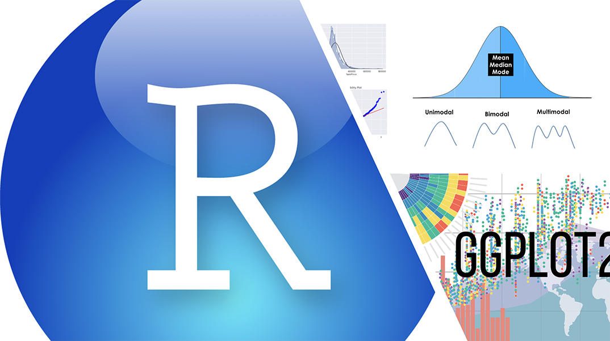

# CURSO-TALLER: INTROODUCCIÓN A R

### 17 - 21 de Agosto de 2020 

## IMPARTIDO POR: 
#### Dr. Alberto Prado Farías 
#### Dr. Ulises Olivares Pinto

## Temario

Día 1: Introducción al lenguaje R 
Objetos R
Disposición de las ventanas de R Studio
Funciones básicas (importación y exportación de datos, revisión y descripción de datos, gráficas XY, gráficas caja y bigote, histogramas, media, desviación estándar)
 
Día 2 Estadística descriptiva 
Más gráficas descriptivas
Cleveland Plot
Histogramas y distribuciones probabilísticas
Agregar colores y formas a las gráficas
Más funciones básicas de estadística descriptiva (regresiones lineales, correlaciones).
T Test
 
Día 3 Manejo y análisis de datos
Importación de librerías
Manejo de datos
Aglomerar, separar, transformar o re-acomodar datos con respecto algunas variables
Ejercicios usando funciones de la familia “apply”
Ejercicios usando funciones “ddply”
 
Día 4 Gráficas usando la librería ggplot2
Gráficos de dispersión
Estéticas
Facetas
grids
Gráficos de líneas
Boxplots
Transformaciones estadísticas
Histogramas
Geometrías adicionales.
Exportación de gráficos.
Día 5 Modelos de efectos mixtos y aplicaciones (4 horas)
Efectos fijos vs aleatorios
Efectos anidados vs cruzados 
Selección de modelos
Visualización y validación de modelos mixtos

| Día        | Temas           | Contenido  |  Material   |
| ------------- |:-------------:         | -----:| -----:|
| Día 1      | Introducción al lenguaje R| * Objetos R * Disposición de las ventanas de R Studio * Funciones básicas (importación y exportación de datos, revisión y descripción de datos, gráficas XY, gráficas caja y bigote, histogramas, media, desviación estándar) |   |
| Día 2      | Estadística descriptiva  |  |    |
| Día 3      | Manejo y análisis de datos |  |   |
| Día 4      | Gráficas usando la librería ggplot2 |  |   |
| Día 5      | Modelos de efectos mixtos y aplicaciones |  |     |

